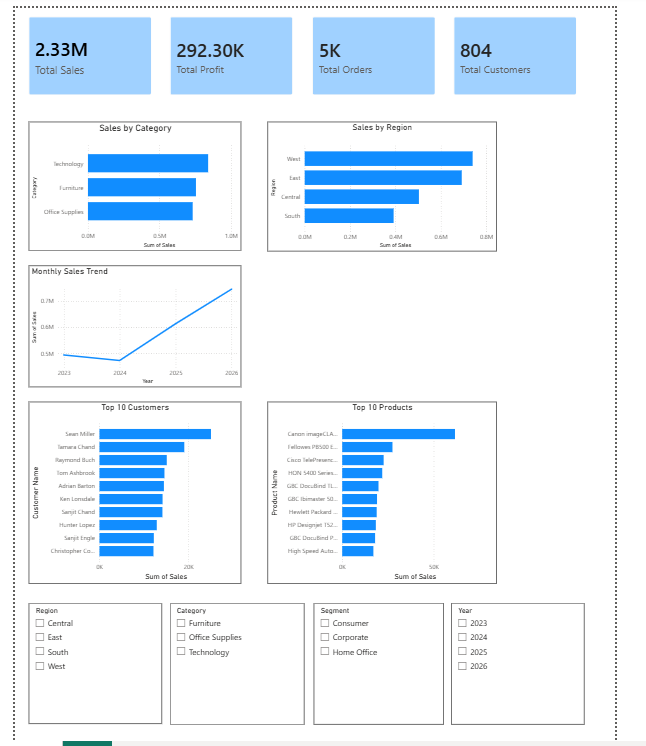

📊 E-Commerce Sales Analytics Dashboard

An end-to-end data analytics project that explores an e-commerce sales dataset using **Python, SQL, and Power BI**. The goal of this project was to clean and analyze the data, answer business-related questions, and build an interactive dashboard that helps visualize sales performance and customer trends.

📌 Project Overview

This project follows a complete data analytics workflow:

- Understanding the dataset
- Cleaning and preparing the data
- Performing exploratory data analysis (EDA)
- Writing SQL queries to answer business questions
- Creating an interactive Power BI dashboard

The dashboard provides a clear view of sales performance across different categories, regions, customers, and products, making it easier to identify trends and business opportunities.

 🛠️ Tools & Technologies

- Python
- Pandas
- NumPy
- SQLite
- Jupyter Notebook
- Power BI
 📂 Project Structure

```
ECommerce-Sales-Analytics/
│
├── dashboard/
│   └── ECommerce_Sales_Dashboard.pbix
│
├── data/
│   └── cleaned_superstore.csv
│
├── notebooks/
│   ├── 01_data_understanding.ipynb
│   ├── 02_data_cleaning.ipynb
│   ├── 03_eda.ipynb
│   ├── 04_customer_analytics.ipynb
│   └── 05_sql_analytics.ipynb
│
├── screenshots/
│   └── dashboard.png
│
└── README.md
```
📈 Dashboard Preview



# 📊 Dashboard Highlights

The Power BI dashboard includes:

- Total Sales
- Total Profit
- Total Orders
- Total Customers
- Sales by Category
- Sales by Region
- Monthly Sales Trend
- Top 10 Customers
- Top 10 Products
- Interactive filters for Region, Category, Segment, and Year

📌 Key Business Insights

- Technology products generated the highest sales among all categories.
- The West region contributed the highest overall revenue.
- A small group of customers accounted for a significant share of total sales.
- Sales performance varied across different years, showing changing business trends.
- Interactive filters make it easy to analyze sales from different business perspectives.

📊 Project Workflow

### 1. Data Understanding
- Explored the dataset structure
- Identified columns and data types
- Checked dataset size and summary statistics

### 2. Data Cleaning
- Removed missing values
- Corrected data types
- Created a cleaned dataset for analysis

### 3. Exploratory Data Analysis (EDA)
- Analyzed sales, profit, and quantity
- Studied category-wise and region-wise performance
- Identified important business trends

### 4. SQL Analysis
- Imported the cleaned dataset into SQLite
- Executed SQL queries to answer business questions
- Retrieved insights using aggregation, filtering, and grouping

### 5. Dashboard Development
- Built an interactive Power BI dashboard
- Added KPI cards, charts, and slicers
- Designed the report for easy business analysis

---

🚀 How to Run the Project

1. Clone this repository.
2. Open the notebooks using Jupyter Notebook or VS Code.
3. Run the notebooks in sequence.
4. Open `ECommerce_Sales_Dashboard.pbix` using Power BI Desktop to explore the interactive dashboard.

 📚 Skills Demonstrated

- Data Cleaning
- Exploratory Data Analysis (EDA)
- SQL Queries
- Data Visualization
- Dashboard Design
- Business Analytics
- Power BI
- Python Programming

👩‍💻 Author
Abinaya Palanivel
